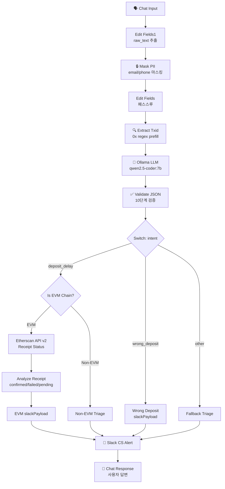
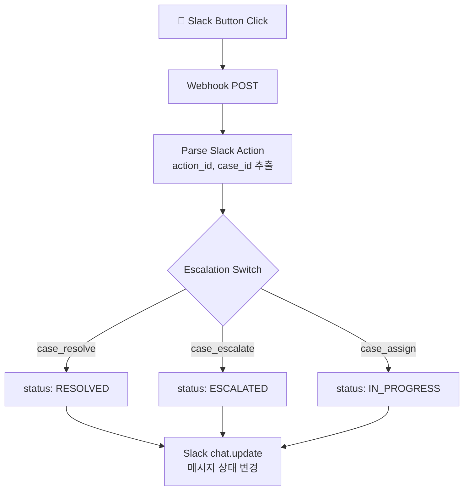
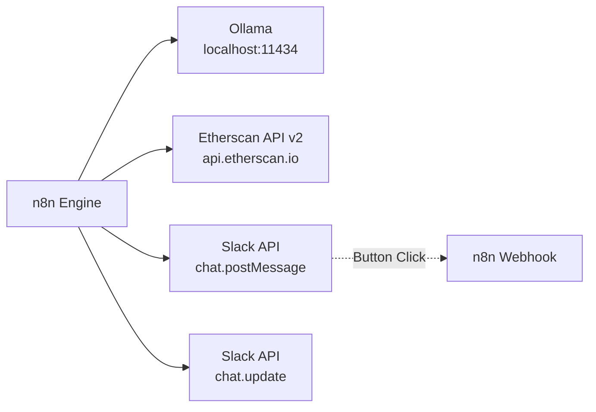

---
tags:
  - architecture
  - crypto-cs
  - n8n
---

# 🏗 아키텍처 & 데이터 흐름

## 전체 구조

하나의 n8n 워크플로우 안에 **2개의 독립 파이프라인**이 공존한다.

| 파이프라인 | 트리거 | 역할 |
|-----------|--------|------|
| **메인** | chatTrigger | 문의 접수 → 분류 → 검증 → Slack 알림 → 사용자 응답 |
| **액션** | Webhook | Slack 버튼 클릭 → 케이스 상태 업데이트 |

## Pipeline 1: CS 문의 처리



## Pipeline 2: Slack 버튼 액션



## 데이터 변환 흐름

각 단계에서 데이터가 어떻게 변하는지:

```
Step 1: Chat Input
  { chatInput: "ETH 10개 보냈는데 안 들어왔어요 0xabc...123" }

Step 2: Edit Fields1
  { raw_text: "ETH 10개 보냈는데..." }

Step 3: Mask PII
  { raw_text: "...", masked: "ETH 10개 보냈는데 안 들어왔어요 0xabc...123" }

Step 4: Extract Txid
  { ..., prefill_txid: "0xabc...123" }

Step 5: Ollama LLM
  { response: '{"intent":"deposit_delay","coin":"ETH","txid":"0xabc...123","network":"ethereum"}' }

Step 6: Validate JSON
  { intent: "deposit_delay", coin: "ETH", txid: "0xabc...123",
    network: "ethereum", chainId: 1, isEvmChain: true }

Step 7: Etherscan
  { status: "1", message: "OK", result: { status: "1" } }

Step 8: Analyze Receipt
  { intent: "deposit_delay", coin: "ETH", txid: "0xabc...",
    action: "review_exchange_crediting", onchain_status: "confirmed_success" }

Step 9: slackPayload
  { ..., slackPayload: { channel: "...", text: "CASE-... created", blocks: [...] } }

Step 10: Chat Response
  { output: "✅ ETH 입금 확인 결과, 온체인 트랜잭션은 정상 처리되었어..." }
```

## 외부 의존성



| 서비스 | 엔드포인트 | 인증 | 장애 시 |
|--------|----------|------|---------|
| Ollama | `http://ollama:11434/api/generate` | 없음 | ❌ 워크플로우 중단 |
| Etherscan | `https://api.etherscan.io/v2/api` | API Key | ⚠️ manual_review 분기 |
| Slack | `https://slack.com/api/chat.postMessage` | Bot Token | ❌ 알림 실패 |
| Slack | `https://slack.com/api/chat.update` | Bot Token | ❌ 상태 업데이트 실패 |
