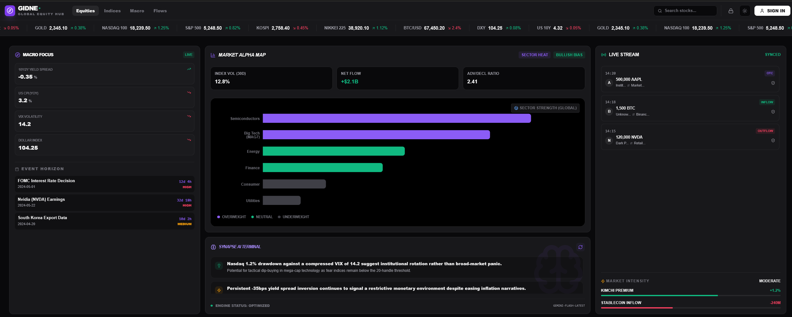

# 🧭 [Project] 투자 내비게이션: 기드네 (Gidne)

> **"복잡한 데이터의 숲에서 수익으로 가는 길을 제시하다."**

---

## 1. 브랜드 아이덴티티

- **의미:** **Guide(길잡이)** + **Node(거점)**. 파편화된 금융 데이터를 연결하여 투자자가 의사결정을 내릴 수 있는 최적의 경로를 제공함.

## 2. 제품 설계 철학 (Core Logic)

### 📈 상대 강도(RS) 로직에 기반한 의사결정

단순 가격 변동은 시장의 소음(Noise)일 뿐입니다. 특히 **레버리지 트레이딩 환경**에서는 시장의 중력을 이겨내는 **'상대적 강세'**만이 실질적인 수익의 지표가 됨을 깨달았습니다.

- **RS 공식:** `RS Spread = Ticker %Δ - Index %Δ`
- **적용:** 지수 대비 초과 수익을 내는 '진짜 대장주'를 실시간으로 필터링하여 리스크는 줄이고 수익률은 극대화합니다.

---

## 3. 정보 시냅스 체계 (Data Architecture)

### 🇺🇸 Section 1: Macro & Global Equity (거시 경제 및 주요 지수)

UI 상단의 티커 보드와 MACRO FOCUS 섹션을 담당하는 실시간 엔진입니다.

| 항목              | 세부 데이터                     | 추천 소스 (API)          | 수집 방식      | 선택 이유 및 시냅스 로직                              |
| :---------------- | :------------------------------ | :----------------------- | :------------- | :---------------------------------------------------- |
| **시장 지수**     | 나스닥 100, S&P 500, 코스피     | Polygon.io / Twelve Data | Websocket      | **[심장]** 개별 종목 상대 강도(RS) 계산의 기준 분모.  |
| **금리 (장단기)** | 미국 국채 10Y, 2Y, Spread       | Finnhub / FRED           | REST (Polling) | 금리 발작 및 장단기 역전(T10Y2Y) 해소 시 변동성 경고. |
| **통화/환율**     | 달러 인덱스(DXY), USD/KRW       | Twelve Data              | Websocket      | 위험 자산 압박 강도 및 외인 수급 환경 실시간 추적.    |
| **원자재**        | 금(Gold), 은(Silver), 유가(WTI) | Twelve Data / Finnhub    | Websocket      | 안전 자산 선호도 및 인플레이션 기대 심리 실시간 반영. |
| **물가 지표**     | US CPI (YoY)                    | FRED                     | REST (Monthly) | CPIAUCSNS 데이터를 통한 장기 인플레이션 추세 확인.    |

### ₿ Section 2: Event Horizon & Alpha Metrics (이벤트 및 시장 강도)

EVENT HORIZON의 일정과 MARKET INTENSITY의 온체인 데이터를 결합합니다.

| 항목            | 세부 데이터                      | 추천 소스 (API)         | 수집 방식      | 선택 이유 및 시냅스 로직                                 |
| :-------------- | :------------------------------- | :---------------------- | :------------- | :------------------------------------------------------- |
| **경제 일정**   | FOMC 금리 결정, CPI 발표일       | Investing.com / Finnhub | REST (Webhook) | 발표 직전 카운트다운 및 발표 직후 변동성 대응 로직 가동. |
| **기업 실적**   | 주요 빅테크(NVDA 등) 실적        | Alpha Vantage / Finnhub | REST (Batch)   | 예상치 대비 실제치(Beat/Miss) 분석 및 주가 반응도 계산.  |
| **선행 지표**   | 한국 수출 데이터                 | 관세청 (KCS)            | REST (Monthly) | 글로벌 경기 및 반도체 업황의 강력한 선행 시그널로 활용.  |
| **온체인 강도** | 스테이블코인 유입, 김치 프리미엄 | CryptoQuant / Upbit     | REST / Custom  | 시장 내 대기 자금 규모 및 국내 투심 과열 상태 측정.      |
| **청산/고래**   | 실시간 청산액, 대형 트랜잭션     | Coinglass / Whale Alert | Websocket      | 대규모 물량 투하 및 강제 청산 지점 기반 지지/저항 파악.  |

### 💧 Section 3: Liquidity & System Logic (유동성 및 연산 엔진)

SYNAPSE AI TERMINAL의 근거가 되는 백엔드 연산 로직입니다.

| 항목            | 연산 공식 및 데이터 ID                          | 소스       | 가공 로직 (Technical Edge)                                     |
| :-------------- | :---------------------------------------------- | :--------- | :------------------------------------------------------------- |
| **순유동성**    | `Net Liquidity = WALCL - (WTREGEN + RRPONTSYD)` | FRED       | 연준 자산에서 TGA, 역레포를 차감하여 실질 현금 흐름 추정.      |
| **상대 강도**   | `RS Ratio = Price(Asset) / Price(Benchmark)`    | Internal   | 지수 대비 초과 수익을 내는 '진짜 대장주' 실시간 필터링.        |
| **변동성 괴리** | MOVE Index vs VIX                               | ICE / CBOE | 채권과 주식 시장의 공포 온도차를 분석하여 하락 징후 선제 포착. |

---

## 4. 기술적 차별점

- **Websocket First:** 시세 지연은 곧 손실입니다. REST API가 아닌 Websocket Stream 방식을 우선하여 '진짜 실시간' 데이터를 지향합니다.
- **Data Synerge:** 거시 경제(FRED)와 실시간 시세(Polygon), 온체인(CryptoQuant)을 하나의 시냅스로 연결하여 통합적 인사이트를 제공합니다.

### 🖥️ 대시보드 UI 컨셉 (Dashboard Mockup)

> _Bento Grid 기반 고성능 대시보드 UI 예시_

---

## 5. 타겟 유저 및 페르소나 (Target User & Persona)

### 🎯 Primary Persona: "시간 부족한 스마트 개미"

| 속성            | 내용                                             |
| --------------- | ------------------------------------------------ |
| **연령/직업**   | 25-40세, 직장인 또는 대학원생                    |
| **투자 경력**   | 1-3년, 중급 수준                                 |
| **투자 스타일** | 레버리지/파생상품 활용, 단기-중기 스윙           |
| **Pain Point**  | 여러 사이트를 옮겨다니며 정보 수집하는 시간 낭비 |
| **Goal**        | 퇴근 후 30분 안에 시장 상황 파악 및 포지션 결정  |

### 🐋 Secondary Persona: "풀타임 트레이더"

| 속성            | 내용                                                 |
| --------------- | ---------------------------------------------------- |
| **연령/직업**   | 30-50세, 전업 투자자                                 |
| **투자 경력**   | 5년 이상, 고급 수준                                  |
| **투자 스타일** | 매크로 + 크립토 연계, 멀티 자산                      |
| **Pain Point**  | 데이터는 많은데 '맥락'이 연결되지 않음               |
| **Goal**        | 매크로 변동이 크립토에 미치는 영향을 선제적으로 포착 |

---

## 6. 문제 정의 (Problem Statement)

### 🔴 현재 투자자가 겪는 핵심 문제

1. **정보 파편화:** 매크로(FRED), 크립토(Coinglass), 온체인(Whale Alert)이 각각 다른 플랫폼에 흩어져 있음
2. **맥락 부재:** 나스닥이 빠질 때 비트코인에 어떤 영향이 있는지 연결해주는 서비스가 없음
3. **시간 비용:** 5-6개 사이트를 순회하며 정보를 종합하는 데 하루 1-2시간 소요
4. **지연된 대응:** REST API 기반 서비스는 실시간성이 부족해 급변장에서 후행적 대응

### 💡 Gidne의 해결 방식

> **"하나의 화면에서, 실시간으로, 맥락까지."**
>
> - 모든 데이터를 Bento Grid 대시보드에 통합
> - Websocket 기반 실시간 스트리밍
> - 시냅스 로직을 통한 자동 알림 (매크로 → 크립토 연쇄 반응 감지)

---

## 7. 경쟁 분석 (Competitive Analysis)

| 서비스                 | 강점                     | 약점                               | Gidne 차별점               |
| ---------------------- | ------------------------ | ---------------------------------- | -------------------------- |
| **TradingView**        | 차트 분석 최강, 커뮤니티 | 매크로 데이터 통합 부족, 정보 과잉 | 매크로-크립토 시냅스 연결  |
| **Coinglass**          | 파생상품 데이터 표준     | 크립토 전용, UI 올드함             | 주식/매크로 통합 + 모던 UI |
| **Fear & Greed (CNN)** | 직관적 심리 지표         | 단일 지표, 맥락 없음               | 복합 지표 기반 맥락 제공   |
| **Investing.com**      | 종합 경제 캘린더         | UI 복잡, 광고 과다                 | 클린 UI, 핵심 이벤트 집중  |
| **CryptoQuant**        | 온체인 분석 전문         | 진입 장벽 높음, 고가               | 핵심 지표만 큐레이션       |

### 🏆 Gidne의 포지셔닝

> **"TradingView의 실시간성 + Coinglass의 파생 데이터 + FRED의 매크로 = 하나의 시냅스"**

---

## 8. 성공 지표 (Success Metrics)

### 📊 핵심 KPI (MVP 단계)

| 지표                       | 목표               | 측정 방법                   |
| -------------------------- | ------------------ | --------------------------- |
| **DAU (일간 활성 사용자)** | 1,000명 (3개월 내) | 로그인 기반 집계            |
| **세션 시간**              | 평균 15분 이상     | Analytics                   |
| **알림 클릭률 (CTR)**      | 20% 이상           | 시냅스 알림 → 대시보드 이동 |
| **NPS (순추천지수)**       | 40 이상            | 분기별 설문                 |

### 🎯 North Star Metric

> **"사용자당 주간 의사결정 횟수"**
>
> - Gidne를 보고 실제 매매 결정을 내린 횟수
> - 목표: 주 5회 이상 (하루 1회)

---

## 9. MVP 우선순위 및 스코프 (MVP Scope & Prioritization)

### ✅ Phase 1: MVP (Must Have)

| 기능                                    | 우선순위 | 이유                          |
| --------------------------------------- | -------- | ----------------------------- |
| **Global Ticker (상단 실시간 시세)**    | P0       | 첫 인상, 즉각적 가치 전달     |
| **Macro Compass (금리/VIX/DXY)**        | P0       | 핵심 차별점, 경쟁사 대비 우위 |
| **Crypto Alpha Map (BTC OI/FR/청산맵)** | P0       | 타겟 유저의 핵심 니즈         |
| **Event Horizon (FOMC/CPI 카운트다운)** | P1       | 행동 유발 트리거              |
| **Whale Alert 스트림**                  | P1       | 실시간 감각 강화              |

### 🔜 Phase 2: Growth (Nice to Have)

| 기능                                | 우선순위 | 이유                    |
| ----------------------------------- | -------- | ----------------------- |
| 시냅스 알림 (Telegram/Discord 연동) | P2       | DAU → Retention 전환    |
| 사용자 맞춤 대시보드 레이아웃       | P2       | 개인화, 락인 효과       |
| 모의투자 리그 ($GDN 토큰)           | P3       | 커뮤니티 활성화, 바이럴 |

### 🚀 Phase 3: Platform

| 기능                       | 우선순위 | 이유                   |
| -------------------------- | -------- | ---------------------- |
| DEX 연동 (Orderly Network) | P3       | One-stop Terminal 완성 |
| API 제공 (B2B)             | P4       | 수익 다각화            |

---

## 10. 리스크 및 완화 전략 (Risks & Mitigation)

| 리스크                   | 영향도 | 완화 전략                                        |
| ------------------------ | ------ | ------------------------------------------------ |
| **API 비용 증가**        | High   | 무료 티어 우선 활용, 캐싱 전략, 점진적 유료 전환 |
| **데이터 지연/장애**     | High   | 다중 소스 Fallback, 장애 시 알림 표시            |
| **규제 리스크 (크립토)** | Medium | 정보 제공에 집중, 직접 거래 기능은 후순위        |
| **경쟁사 모방**          | Medium | 시냅스 로직(알고리즘) 차별화, 빠른 iteration     |
